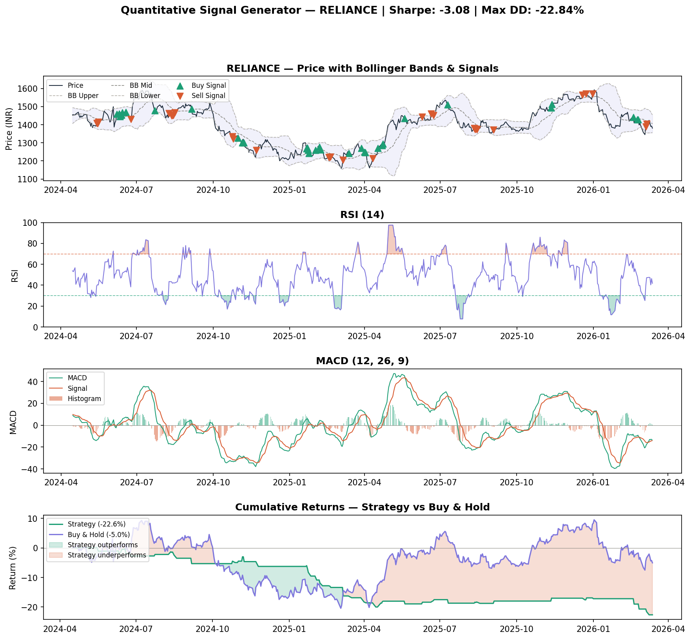

# Quantitative Signal Generator

A quantitative trading signal pipeline that combines four technical indicators 
into a composite signal score, then backtests the strategy against buy-and-hold 
on real NSE data.

## Output


## How it works

Four indicators each cast a vote: **+1 bullish, -1 bearish, 0 neutral**

| Indicator | Buy Signal | Sell Signal |
|---|---|---|
| RSI (14) | RSI < 35 (oversold) | RSI > 65 (overbought) |
| MACD (12,26,9) | MACD > Signal line | MACD < Signal line |
| Bollinger Bands | Price in lower 20% | Price in upper 80% |
| Momentum (20d) | Return > +2% | Return < -2% |

Composite score ranges from **-4 to +4**.  
Trade triggers when score ≥ +2 (buy) or ≤ -2 (sell).

## Performance metrics
| Metric | Description |
|---|---|
| Sharpe Ratio | Risk-adjusted return vs Indian risk-free rate (6.5%) |
| Max Drawdown | Largest peak-to-trough loss during backtest |
| Win Rate | % of trades that were profitable |
| vs Buy & Hold | Strategy return compared to passive holding |

## Output chart panels
1. **Price + Bollinger Bands** — buy/sell signals overlaid on price
2. **RSI** — overbought/oversold zones highlighted
3. **MACD** — signal crossovers and histogram
4. **Cumulative returns** — strategy vs buy-and-hold with outperformance shading

## How to run
```bash
pip install pandas numpy matplotlib yfinance scipy
python3 signal_generator.py
```

Change `TICKER` on line 10 to analyse any NSE stock (e.g. `"TCS.NS"`, `"HDFCBANK.NS"`)

## Important note
This is a research and educational project. Past backtested performance 
does not guarantee future returns. Signal strategies require rigorous 
out-of-sample testing before any real application.

## What I'd improve next
- Add out-of-sample testing to avoid overfitting
- Incorporate ML-based signal weighting (XGBoost on signal features)
- Add transaction cost modelling
- Extend to multi-asset portfolio signals

## Related projects
- [Credit Risk Scorecard](https://github.com/techgirlme/credit-risk-scorecard) — logistic regression default prediction
- [Portfolio Optimiser](https://github.com/techgirlme/portfolio-optimiser) — Markowitz efficient frontier

## Author
**Parvathy Raman**  
B.Sc. Data Science & Applied Statistics — Symbiosis Statistical Institute, Pune  
 
[LinkedIn](linkedin.com/in/parvathy-raman-82a7ba354)
